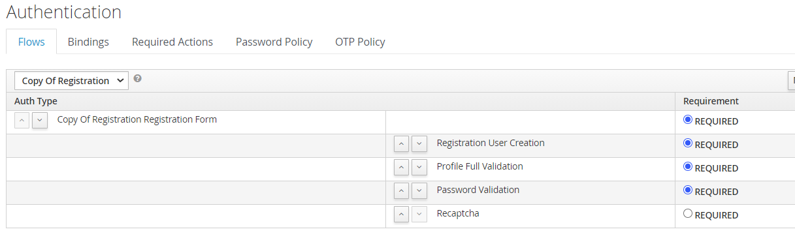
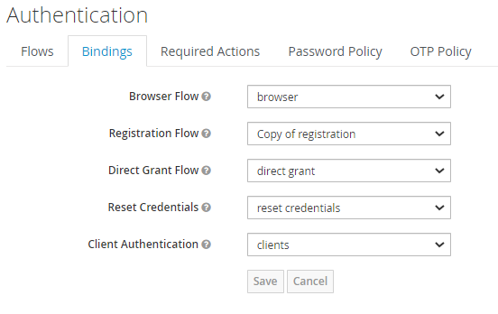
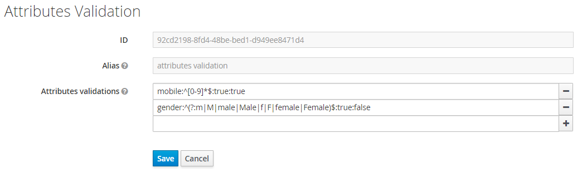

# Keycloak Registration Validation

Validate user profile nad attributes server-side

# Features
* Required: choose if you want any attribute is mandatory.
* Unique: check if the data isn't already exists (like mobile number).
* Pattern: Specifies a regular expression that defines a pattern the entered data needs to follow.
* Localization: you can localize error messages for invalid entered data.

Tested on Keycloak 7.0.0

### Example for Registration flow

 
 ### Change the bindings for Registration flow

 
### Example for configurations
I didn't find a better why to apply this, so
our recipe is attributeName:attributeRegex:isRequired:isUnique\
```e.g: mobile:^[0-9]*$:true:true```\
\
 
